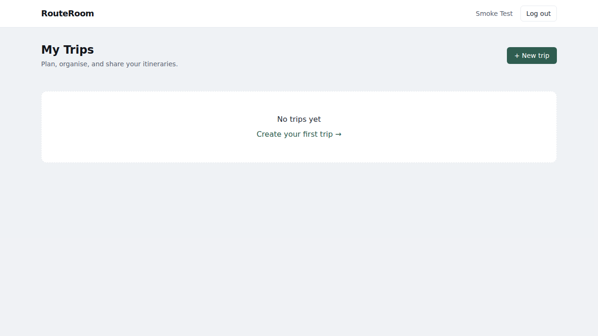
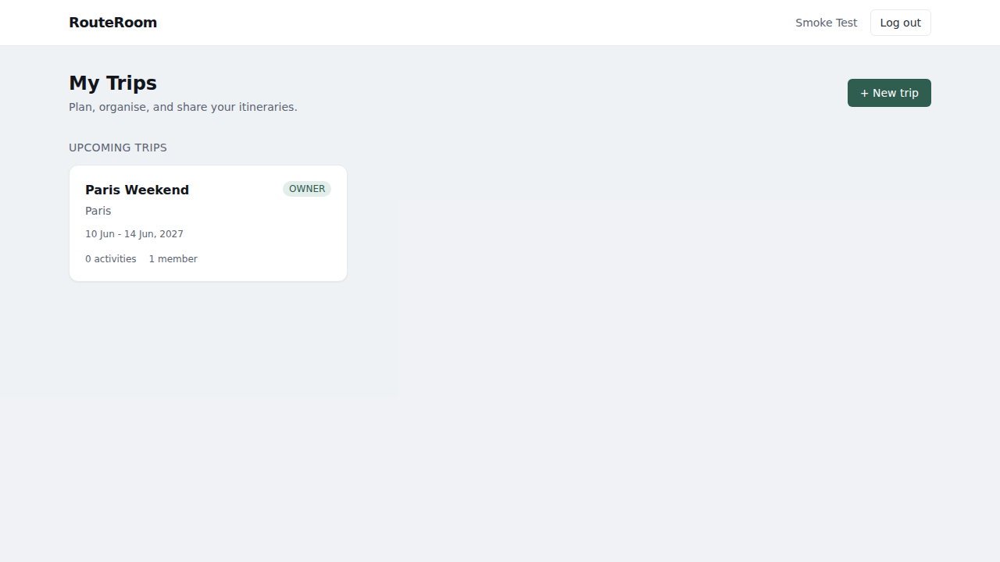
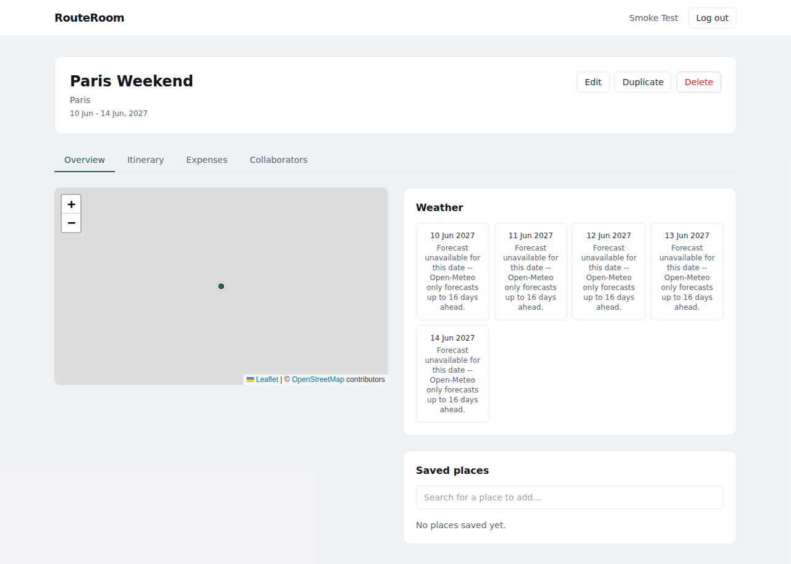
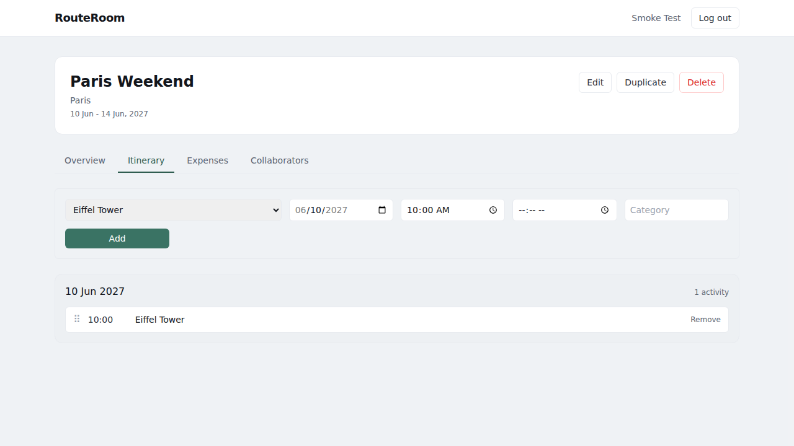

# RouteRoom

A collaborative trip-planning and itinerary manager. Create a trip,
search real places, build a day-by-day itinerary, see real travel times
and weather, split expenses, and invite collaborators with role-based
permissions.

This is a full-stack portfolio project, not a commercial product -- it's
not trying to compete with Google Maps or TripAdvisor. The goal was to
build something genuinely functional end-to-end, backed by real external
data, rather than a UI mockup over fake data.

## Screenshots

These are real captures of the running application, not mockups.

| | |
|---|---|
|  |  |
|  |  |

## Features

- **Accounts** -- register/login/logout, bcrypt-hashed passwords, JWT
  access token + revocable refresh session in `httpOnly` cookies.
- **Trips** -- create/edit/delete/duplicate, each with a real destination
  (geocoded, not free text).
- **Real place search** -- powered by OpenStreetMap's Nominatim; save a
  result to a trip and it's persisted (no repeat API calls).
- **Interactive map** -- Leaflet + real OpenStreetMap tiles, showing the
  destination, saved places, and the itinerary's route.
- **Itinerary builder** -- activities grouped by day, drag-and-drop
  reordering, notes/category/status.
- **Itinerary intelligence** -- computed (not hard-coded) warnings for
  overlapping activities, insufficient travel time between activities
  (using a real routing API), activities scheduled outside the trip's
  dates, and "packed day" flags.
- **Real routing** -- walking/driving time and distance between
  activities via a public OSRM instance.
- **Real weather** -- forecast (or recent history) for each day of the
  trip via Open-Meteo, based on the destination's actual coordinates. If
  a date is outside what the provider supports, the app says so honestly
  instead of making something up.
- **Expenses** -- add an expense, split equally or with custom shares,
  and see a simplified "who owes whom" settle-up computed from every
  expense on the trip.
- **Collaboration** -- invite other registered users as `EDITOR` or
  `VIEWER`; every permission is enforced server-side, not just hidden in
  the UI.
- **Live updates** -- a lightweight WebSocket layer tells collaborators
  viewing the same trip to refresh when something changes.

## Tech stack

| | |
|---|---|
| Frontend | React 18, TypeScript, Vite, Tailwind CSS, TanStack Query, react-router-dom, react-leaflet, @dnd-kit |
| Backend | Node.js, TypeScript, Express, Prisma, Zod, `ws` |
| Database | PostgreSQL |
| Testing | Vitest, Supertest, React Testing Library |
| Infra | Docker Compose, GitHub Actions |

See [docs/architecture.md](docs/architecture.md) for why each of these
was chosen and how the pieces fit together.

## External APIs -- no keys required

RouteRoom deliberately uses only free, keyless public APIs, so there is
**no signup step** between cloning the repo and running it:

| Purpose | Provider | Key required? | Notes |
|---|---|---|---|
| Geocoding / place search | [Nominatim](https://nominatim.org/) (OpenStreetMap) | No | Public usage policy caps requests at ~1/sec; the app caches results in Postgres and sends a descriptive `User-Agent` to stay within policy. |
| Routing | [OSRM via FOSSGIS](https://routing.openstreetmap.de/) | No | Public demo instances for walking (`routed-foot`) and driving (`routed-car`) profiles. Not for production-scale traffic. |
| Weather | [Open-Meteo](https://open-meteo.com/) | No | Forecasts up to 16 days ahead, recent history via the same endpoint. |

If any of these is temporarily unreachable, the relevant feature degrades
gracefully with an honest error message (e.g. "Route information is
temporarily unavailable") -- the rest of the app keeps working, and
nothing falls back to fabricated data.

## Getting started

### Requirements

- Node.js 20+
- PostgreSQL 16 (or Docker, to avoid installing it locally)

### Environment variables

```bash
cp .env.example .env
```

| Variable | Required | Default | Notes |
|---|---|---|---|
| `DATABASE_URL` | yes | -- | Postgres connection string. |
| `JWT_SECRET` | yes | -- | Generate with `openssl rand -base64 48`. |
| `PORT` | no | `4000` | API port. |
| `CORS_ORIGIN` | no | `http://localhost:5173` | Comma-separated allowed origins. |
| `VITE_API_URL` | no | `http://localhost:4000/api` | Where the frontend sends requests. |
| `NOMINATIM_BASE_URL`, `OSRM_BASE_URL`, `OPEN_METEO_BASE_URL` | no | see `.env.example` | Override only if self-hosting one of these. |

No other API keys are needed (see [External APIs](#external-apis----no-keys-required) above).

### Running locally (without Docker)

```bash
npm install                     # installs client + server via npm workspaces

# start Postgres however you prefer, then:
cp .env.example server/.env     # edit DATABASE_URL/JWT_SECRET as needed
npm run prisma:migrate --workspace server   # or: cd server && npx prisma migrate dev

cp client/.env.example client/.env

npm run dev:server              # terminal 1
npm run dev:client              # terminal 2
```

Visit `http://localhost:5173`.

### Running with Docker

```bash
cp .env.example .env            # fill in JWT_SECRET at minimum
docker compose up --build
```

This starts Postgres, the API (with migrations applied automatically on
boot), and the Vite dev server -- visit `http://localhost:5173`. Source
directories are bind-mounted for hot-reload, so this is meant for local
development, not a production deployment (see
[Known Limitations](#known-limitations)).

### Running tests

```bash
npm test                         # server + client
npm run test --workspace server  # server only (needs a reachable Postgres test DB --
                                  # see server/vitest.config.ts for the default connection string)
npm run test --workspace client  # client only
```

### Linting & type-checking

```bash
npm run lint
npm run typecheck
```

## Project structure

```
/client         React + Vite frontend
/server         Express API
  /prisma       Schema + migrations
  /src
    /routes     Thin HTTP layer: validation + response shaping
    /services   Business logic (unit-testable, no HTTP dependency)
    /middleware Auth, role-based authorization, error handling
    /realtime   WebSocket broadcast
/docs           Architecture + API documentation
```

## Architecture decisions, challenges, and limitations

See [docs/architecture.md](docs/architecture.md) for the full write-up.
Highlights:

- **Monolith over microservices** -- one Express API, one database. There
  was no scaling requirement to justify splitting services, and doing so
  would only add operational and network overhead.
- **No Redis** -- three small Postgres tables cache external API
  responses with a TTL check in the service layer. That's enough at this
  scale; introducing Redis would add an operational dependency for no
  real benefit here.
- **Real-time is "refresh signal", not CRDT/OT** -- a WebSocket broadcast
  tells collaborators to re-fetch over REST rather than merging patches
  into client state. Simpler to reason about, and appropriate for a
  day-planner where simultaneous conflicting edits are rare.

### Challenges

- **Picking routing/geocoding providers that need zero API keys.** Most
  tutorials default to Google Maps or a paid provider. Landing on
  Nominatim + a FOSSGIS-hosted OSRM instance + Open-Meteo meant the whole
  app runs with `docker compose up` and nothing else -- but it also meant
  reading each provider's usage policy carefully (Nominatim's 1 req/sec
  cap in particular) and building the caching layer to respect it.
- **Honest weather instead of fake data.** Open-Meteo's forecast window
  is 16 days; a trip planned further out than that has no real forecast
  yet. It would have been easy to just show *something* -- instead the
  app computes exactly how far out of range a date is and says so.

### Future improvements

- Email verification and password reset (currently out of scope --
  registration only checks for a unique email).
- Custom (non-equal) travel-time-aware suggestions for reordering a day.
- Offline/PWA support for viewing an itinerary without connectivity.
- Self-hosting the geocoding/routing services for higher rate limits if
  this were ever used beyond a handful of concurrent users.

### Known limitations

- **Not production-hardened security.** Rate limiting and input
  validation exist, but there's no email verification, no CAPTCHA, no
  audit logging, and secrets are managed via a plain `.env` file. This is
  appropriate for a local/portfolio project, not for handling real user
  data at scale.
- **Docker Compose is a dev setup**, not a production deployment (bind
  mounts, dev servers, no reverse proxy/TLS).
- **Public OSRM/Nominatim instances** have modest rate limits and no
  uptime guarantee -- fine for demoing this project, not for heavy
  concurrent use.
- **No pagination** on list endpoints (trips, activities, expenses) --
  fine at the scale of a personal trip planner, would need addressing for
  a user with hundreds of trips.

## License

MIT
