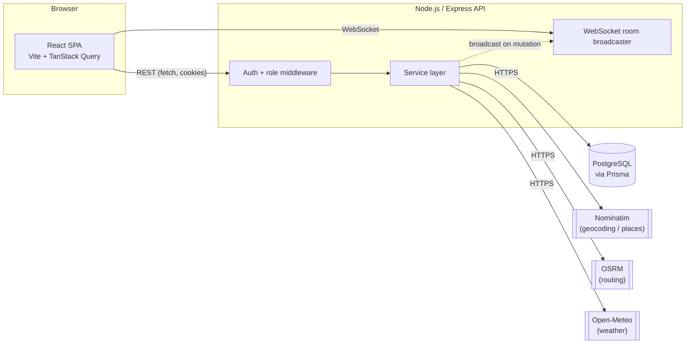

# Architecture

RouteRoom is a monolithic full-stack app: one React SPA talking to one
Express API, backed by one PostgreSQL database. That's a deliberate choice
-- see [Architecture Decisions](#architecture-decisions) below.

## System overview

## Frontend

- **React 18 + TypeScript + Vite.** No server-side rendering -- this is a
  logged-in productivity tool, not a public content site, so SPA is the
  simpler and correct choice.
- **TanStack Query** owns all server state (trips, activities, expenses,
  etc.). Local component state (`useState`) handles form inputs and UI
  toggles only. There is no separate global store (Redux/Zustand) --
  TanStack Query's cache plus one small `AuthContext` for the current user
  is enough for an app this size.
- **react-router-dom** for client-side routing, with a single
  `ProtectedRoute` wrapper gating everything except `/login` and
  `/register`.
- **react-leaflet** renders the map using free OpenStreetMap raster tiles.
  Markers use inline CSS `divIcon`s rather than Leaflet's default marker
  images, which don't resolve cleanly through Vite's bundler.
- **@dnd-kit** provides drag-and-drop reordering of activities within a
  day. It was chosen over `react-beautiful-dnd` (unmaintained) and over
  hand-rolled HTML5 drag events (a11y and touch support are non-trivial to
  get right from scratch).

## Backend

- **Express + TypeScript.** Routes are thin: they validate input with
  `zod`, delegate to a service module, and shape the HTTP response. All
  business logic (validation rules, scheduling analysis, expense math)
  lives in `server/src/services/*.ts` and is unit-testable without an HTTP
  layer.
- **Prisma + PostgreSQL** for persistence. The schema
  (`server/prisma/schema.prisma`) is fully relational -- users, trips,
  memberships, places, activities, expenses, expense participants -- with
  foreign keys and cascading deletes rather than embedded JSON blobs,
  because the data genuinely has relational structure (a trip has many
  members, an expense has many participants who each belong to a user).
- **External API clients** (`services/geocoding.service.ts`,
  `services/routing.service.ts`, `services/weather.service.ts`) are the
  only modules that call out to Nominatim, OSRM, and Open-Meteo. Every
  other part of the app is unaware these are HTTP calls to third parties.

## Authentication

JWT access token (15 min, `httpOnly` cookie) + a rotating refresh token
backed by a `Session` table (so a session can be revoked server-side on
logout, unlike a bare stateless JWT). Passwords are hashed with bcrypt
(cost factor 12). See [Known Limitations](../README.md#known-limitations)
for what this intentionally does not cover (email verification, OAuth,
MFA).

## Authorization

Every trip has an `OWNER`, and members with `EDITOR` or `VIEWER` roles.
`requireTripRole(minRole)` (`server/src/middleware/tripAccess.ts`) is the
single gate every trip-scoped route runs through -- it loads the caller's
membership row and rejects (403) if their role is insufficient, or (404,
not 403) if they aren't a member at all, so a non-member can't even infer
that a trip ID exists. The frontend hides buttons a `VIEWER` can't use as
a UX nicety, but every mutating endpoint re-checks the role itself; nothing
relies on the client behaving.

## Data flow: adding a place

1. Frontend calls `GET /api/places/search?q=...` (debounced as the user
   types).
2. The route requires auth but not trip membership -- search itself isn't
   trip-scoped.
3. `geocoding.service.ts` normalizes the query, checks `GeocodeCache` for a
   fresh (< 30 days) cached result, and only calls Nominatim on a cache
   miss.
4. The user picks a result; the frontend calls
   `POST /api/trips/:tripId/places` with that result's fields.
5. The server persists it as a `Place` row scoped to the trip. From then
   on, activities reference that `Place` by ID -- no repeat geocoding.

## Itinerary intelligence

`services/itinerary.service.ts` recomputes, on every request, from the
stored activities (no cached/precomputed warnings):

- Activities scheduled outside the trip's date range.
- Overlapping activities on the same day (an activity with no end time is
  assumed to last 60 minutes for this check).
- Travel-time conflicts: for each consecutive pair of activities in a day,
  it calls the routing service (walking profile) and compares the route
  duration against the actual gap between them.
- "Packed day" flags once a day crosses 5 activities or 2 hours of total
  computed travel time.

If the routing call for a given pair fails (OSRM unreachable, no route
found), that one segment is marked `available: false` with a reason --
the rest of the day's analysis still returns.

## Error handling & graceful degradation

Every external call is wrapped so a failure surfaces as a specific,
honest message rather than fake data or a stack trace:

- Nominatim/OSRM/Open-Meteo unreachable or erroring -> `502` with a
  message like "Route information is temporarily unavailable."
- A date outside Open-Meteo's forecast/history window -> `200` with
  `{ available: false, reason: "..." }`, never a fabricated forecast.
- Everything else (bad input, missing resource, permission denied) maps to
  the appropriate `4xx` via `HttpError` and a central Express error
  handler (`middleware/errorHandler.ts`), which also normalizes Prisma and
  Zod errors into the same JSON shape.

## Caching

Three small Postgres tables (`GeocodeCache`, `RouteCache`, `WeatherCache`)
cache external responses with a TTL checked in the service layer (30
days / 7 days / 1 hour respectively). This exists mainly so the app is a
polite client of free public services (Nominatim in particular asks
callers not to hammer it), not as a general performance layer. Redis would
be overkill at this scale and adds an operational dependency the project
doesn't need.

## Real-time collaboration

A single `ws` WebSocket server groups connected clients by `tripId`
("room"). When a mutation happens (activity created, expense added, etc.),
the server broadcasts a bare `{ event, tripId }` message to that room;
clients react by invalidating the relevant TanStack Query cache key and
re-fetching over REST. There's no attempt to merge a diff/patch into
client state or resolve concurrent edits (no CRDT/OT) -- for a
day-planning app, conflicting simultaneous edits are rare and low-stakes,
and a "someone changed something, go re-fetch" model is far simpler to
reason about and test than a merge protocol. See `server/src/realtime/ws.ts`
for the design note in context.

## Testing

- **Server:** Vitest + Supertest hit the real Express app against a real
  (local) Postgres test database, truncated between tests. External APIs
  are mocked at the service-module boundary (`vi.mock` on
  `routing.service.ts`, or stubbing `global.fetch`) so tests are fast and
  deterministic -- they test *our* integration code (caching, error
  mapping, retry-free failure handling), not Nominatim's uptime.
- **Client:** Vitest + React Testing Library, with the `api/*` modules
  mocked so components are tested against realistic API shapes without a
  running backend.

## CI

GitHub Actions runs one job: install (npm workspaces, single lockfile) ->
lint -> typecheck -> apply Prisma migrations against a Postgres service
container -> server tests -> client tests -> build both packages. See
`.github/workflows/ci.yml`.

## Architecture decisions

- **Monolith, not microservices.** One Express process, one database.
  There's no independent scaling or deployment need that would justify
  splitting this into services, and doing so would only add network calls
  and operational surface for no benefit at this scale.
- **No Redis / message queue.** See [Caching](#caching) above -- a
  Postgres table with a TTL check covers the actual need.
- **npm workspaces over a tool like Nx/Turborepo.** Two packages
  (`client`, `server`) don't need a build-orchestration framework; npm's
  built-in workspaces are enough.
- **REST over GraphQL.** The data-fetching patterns here are simple
  resource CRUD plus a couple of computed views (itinerary analysis,
  balances) -- GraphQL's main advantages (flexible client-driven queries,
  avoiding over-fetching across many resource shapes) don't pay for their
  added complexity at this scale.
